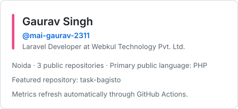

# Gaurav Singh

## About Me

I am a Laravel developer at **Webkul Technology Pvt. Ltd.** in Noida with more than four years of experience building web applications and backend systems. I work primarily in the Laravel ecosystem — designing multi-tenant SaaS platforms, REST and GraphQL APIs, and modular packages that stay compatible across framework releases. I enjoy turning complex requirements into clean, maintainable solutions.

### 🚀 Professional Profile

- **Experience:** 4+ years in software development
- **Current role:** Laravel Developer at Webkul Technology Pvt. Ltd., Noida
- **Expertise:** Full-stack web development, Bagisto & Krayin CRM ecosystems
- **Architecture:** Multi-tenant SaaS — database-per-tenant provisioning, filesystem tenancy and per-tenant configuration
- **Engineering:** Pest, PHPUnit and Playwright test suites wired into GitLab CI and GitHub Actions pipelines
- **Performance:** Redis caching, LiteSpeed page cache and Eloquent query optimisation for high-traffic storefronts
- **Open Source:** Contributor to Bagisto core and its LiteSpeed Cache and OAuth Razorpay packages
- **Focus:** Delivering scalable, high-performance digital solutions with an AI-first workflow

## 🛠️ Featured Project

### [Bagisto Delivery Instructions](https://github.com/mai-gaurav-2311/task-bagisto)

A Bagisto checkout enhancement that lets customers add delivery instructions while placing an order. The public repository is built primarily with PHP and Blade, with JavaScript and CSS supporting the storefront experience.

## 💡 Technical Expertise

| Area | Stack |
| :--- | :--- |
| **Frontend** |     |
| **JavaScript** |        |
| **Backend** |      |
| **E-commerce &amp; CRM** |   |
| **Testing &amp; Quality** |     |
| **DevOps &amp; CI/CD** |     |
| **AI Tools** |         |
| **APIs** |      |
| **Payments** |   |
| **Data &amp; Cache** |    |
| **Version Control** |    |
| **Project Mgmt** |   |
| **IDE** |  |

## 📊 GitHub Activity

<picture>
  <source media="(prefers-color-scheme: dark)" srcset="https://raw.githubusercontent.com/mai-gaurav-2311/mai-gaurav-2311/output/github-snake-dark.svg">
  <source media="(prefers-color-scheme: light)" srcset="https://raw.githubusercontent.com/mai-gaurav-2311/mai-gaurav-2311/output/github-snake.svg">
  
</picture>

## 🌱 Open Source Contributions

- **[bagisto/bagisto](https://github.com/bagisto/bagisto)** — contributions to the core e-commerce framework: return & cancel flow, refunds for invoiced items, and the related event layer
- **[bagisto/lite-speed-cache](https://github.com/bagisto/lite-speed-cache)** — LiteSpeed page-cache integration, including private-cache handling for cart, compare and wishlist
- **[bagisto/oauth-razorpay-payment-gateway](https://github.com/bagisto/oauth-razorpay-payment-gateway)** — OAuth-based Razorpay payment gateway for Laravel

## 🌟 Professional Highlights

- **Bagisto Expert** — building, customizing, and extending Bagisto e-commerce modules, storefronts, and admin workflows
- **Krayin CRM Expert** — designing custom CRM modules, integrations (WhatsApp, Mailchimp), and lead-management workflows
- **Multi-Tenant SaaS Architecture** — database-per-tenant provisioning, filesystem tenancy, per-tenant configuration and subscription plans
- **Test & CI Discipline** — Pest/PHPUnit suites, Playwright end-to-end coverage, and GitLab CI / GitHub Actions pipelines running on every push
- **AI First Development** — leveraging Claude, GitHub Copilot, Codex, and other AI tools throughout the SDLC for faster prototyping, code review, debugging, and documentation
- **Modular Architecture Approach** — designing decoupled, reusable, config-driven modules that scale cleanly across Laravel-based platforms
- Dedicated to writing clean, maintainable, and efficient code, and to continuously exploring emerging technologies

## 📫 Get in Touch

